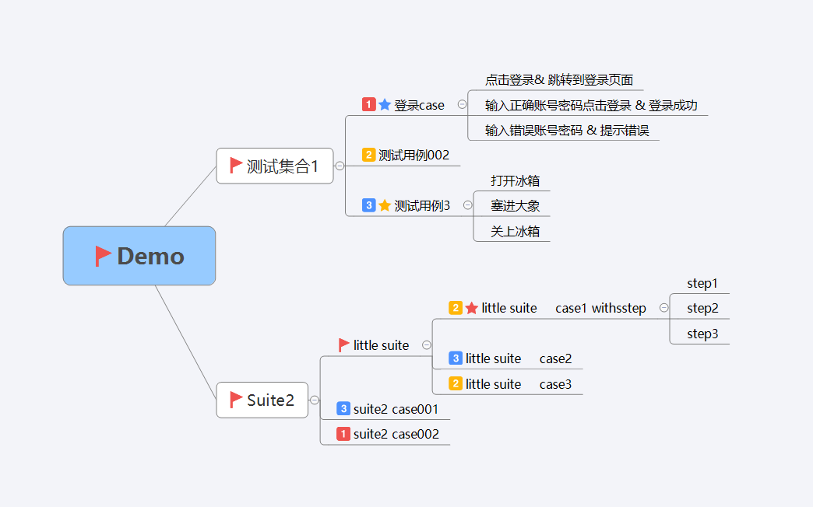
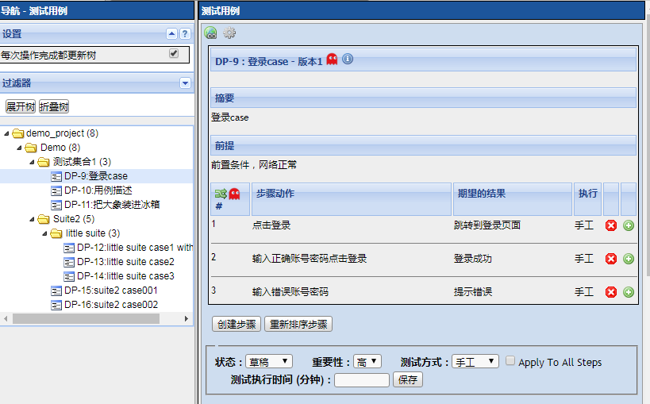

使用freemind创建的测试用例导出成testlink可导入的xml文件
xmind编写的用例请导出为freemind格式文件(.mm后缀文件)

#### **freemind、xmind用例编写要求：**

- TestSuite需要加上相关的图标：  旗帜 （对颜色无要求）
- 有步骤的用例需要加上相关的图标： 星星 （对颜色无要求）
- 有步骤的用例 各个步骤的描述及期望结果用 & 进行分隔   （例如： ‘点击登录按钮 & 登录成功’）
- 用例优先级需要加上相关的图标：1 2 3 --->高 中 低  (标注其他数字图标的 默认是中优先级)

具体的编写可以参照Demo.mm 、Demo.xmind作为参考

#### **使用说明**
- xmind编写的用例请导出为freemind文件

- 将需要转换的freemind文件(例如demo.mm) 复制到当前文件夹

- 根据编写freemind的时候suite配置的图标，点击By_folder.exe(以文件夹标记suite) 或者By_flag.exe(以旗帜标记为suite)，双击即可生成xml文件和logger.log（log文件可查看导出的相关日志）

- 将生成的xml文件导入到Testlink就好啦

- mm文件的文件名最好不要出现特殊符号

  

#### **注意：**

- 生成的xml文件在导入testlink时，中心主题没有设定为suite的，请在testlink中手动创建一个测试用例集，将xml导入到testlink指定的用例集下。以免和原有的测试用例混淆造成管理混乱 （也可以直接在顶层加上小旗子或者文件夹的图标，这样导出到testlink就是在一个文件夹下了）
- 执行exe后会将文件夹下所有的.mm文件全部执行转换生成xml，为避免造成运行错误，请尽量保持文件夹下只有一个mm文件。
